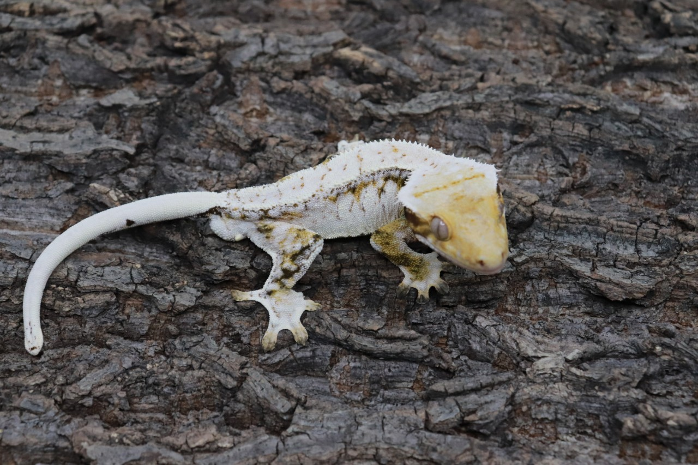
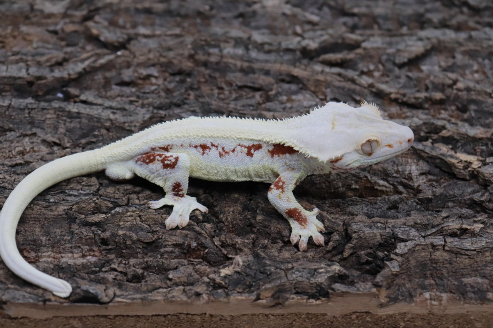
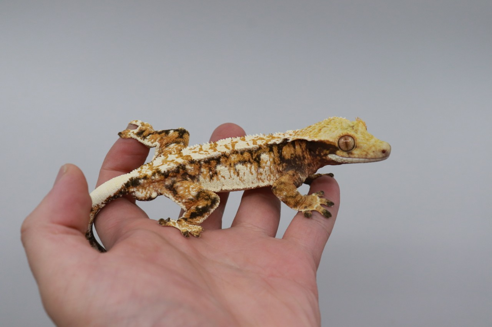

<h1 align="center">🎮 Welcome to Woni16's GameDev Universe! 🌌</h1>

  
  
  

---

## 🧙‍♂️ About Me

> **“상상은 현실이 되고, 코드는 세계를 만든다.”**

- 🎮 **게임에 진심인 개발자** Woni16입니다!
- 💡 창의적인 아이디어를 코드로 구현하는 걸 좋아합니다.
- 🔧 게임 로직, AI, 물리 엔진, 툴 제작에 관심이 많습니다.
- 🎓 혼자서도 공부하며 꾸준히 성장 중입니다.

## 📸 현생 이미지

  
  
  

## 🛠 Tech Stack

### 💬 언어

### 🎮 툴 & 엔진

---

## 🕹️ Projects

### 🎲 Anima (Unity 2D 액션 게임)
> `C#`, `Unity`
- 🔥 스킬 조합, 적 AI, 체력/스태미나 시스템
- 🎨 직접 UI, 애니메이션, 씬 구성
- 💯 학교 개발 프로젝트

---

## 📚 지금 공부 중이에요

- 🛠 **Unreal Engine 5**: C++ 중심 심화 학습

---

## 📬 Contact

- 📧 Email: **jongwon16@naver.com**
- 💼 GitHub: [https://github.com/Woni16](https://github.com/Woni16)

---

  

